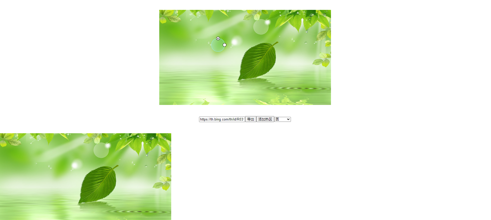

## 图片热区编辑组件说明文档。The Document of image hot area editor。
### 这个说明文档是这样的：一段中文，然后一段英文。我懒得写两份文档。🤪
### This instruction document is like this: one paragraph in Chinese, then one paragraph in English. I'm too lazy to write two documents.🤪

#### 如何使用：
#### how to use:

- 准备vue环境,导入组件。Preparing vue, import HotAreaEditor.

```javascript
import HotAreaEditor from './HotAreaEditor.vue'
``` 

- 使用组件。use HotAreaEditor

```html
<div class="box-editor">
    <HotAreaEditor :url="url" ref="editor1" :shape="shape" :svgEditorOpen="svgEditorOpen"></HotAreaEditor>
</div>
```
**注：**prop中json与url你必须提供其中一个。
**tips：**You must provide one of the json and url in prop.

- 添加热区。add area.
```javascript
this.$refs.editor1.addArea()
```
**注：**你必须新描画出你需要添加的多边形状才能添加热区到图像。svgEditorOpen=true 可以打开多边形编辑器，你直接在点击添加顶点，然后关闭编辑器，添加热区即可。需要注意的是，你添加完这个热区后会清除你在多边形编辑器里面的内容
**tips：**You must newly draw the polygon you need to add in order to add the hot zone to the image. svgEditorOpen=true opens the polygon editor, you can add the hot zone directly by clicking Add Vertex and then closing the editor. Note that after you add the hot zone, it will clear your content in the polygon editor。
```javascript
let code = this.$refs.editor1.exportCode()
this.html = code.html
console.log(code)
```

#### 如何跑这个例子：
#### how to run this example app:
- 安装vue-cli与相应的扩展。install the vue-cli and a global addon to be installed along with the Vue CLI
```shell
npm install -g @vue/cli
npm install -g @vue/cli-service-global
```

- 在App.vue同级目录下跑起来。Run it in the App.vue sibling directory.
```shell
vue serve
```
- 如果成功会出现类型下面的提示。if success running console tips like this.
```
App running at:
- Local:   http://localhost:8080/
- Network: http://192.168.0.74:8080/
``` 

- 打开地址，效果如下。Open the address, the effect is as follows.



- 最终效果。final effect.


#### 细节说明：
#### Detailed description:

- 格式定义。Format Definition.

```json
 {
  'name':'',
  'version':1.0,
  'image':{
     'url':"http://baidu.com/logo.jpg",
     'height':50,
     'width':200,
     'areas':[{
         'type': 'rect',
         'point':[{}]
         'radius':null,
         'url': '',
         'clazz': '',
         'target':''
         'detail': ''
     }]
    }
 }
```